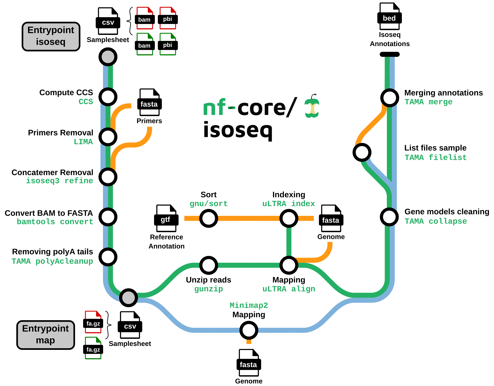

<h1>
  <picture>
    <source media="(prefers-color-scheme: dark)" srcset="docs/images/nf-core-isoseq_logo_dark.png">
    
  </picture>
</h1>

[](https://github.com/nf-core/isoseq/actions/workflows/ci.yml)
[](https://github.com/nf-core/isoseq/actions/workflows/linting.yml)
[](https://nf-co.re/isoseq/results)
[](https://www.nf-test.com)
[](https://doi.org/10.5281/zenodo.7116979)

[](https://www.nextflow.io/)
[](https://docs.conda.io/en/latest/)
[](https://www.docker.com/)
[](https://sylabs.io/docs/)
[](https://cloud.seqera.io/launch?pipeline=https://github.com/nf-core/isoseq)

[](https://nfcore.slack.com/channels/isoseq)[](https://twitter.com/nf_core)[](https://mstdn.science/@nf_core)[](https://www.youtube.com/c/nf-core)

## Introduction

**nf-core/isoseq** is a bioinformatics best-practice analysis pipeline for Isoseq gene annotation with uLTRA and TAMA. Starting from raw isoseq subreads, the pipeline:

- Generates the Circular Consensus Sequences (CSS)

- Clean and polish CCS to create Full Length Non Chimeric (FLNC) reads

- Maps FLNCs on the genome

- Define and clean gene models



The pipeline is built using [Nextflow](https://www.nextflow.io), a workflow tool to run tasks across multiple compute infrastructures in a very portable manner. It uses Docker/Singularity containers making installation trivial and results highly reproducible. The [Nextflow DSL2](https://www.nextflow.io/docs/latest/dsl2.html) implementation of this pipeline uses one container per process which makes it much easier to maintain and update software dependencies. Where possible, these processes have been submitted to and installed from [nf-core/modules](https://github.com/nf-core/modules) in order to make them available to all nf-core pipelines, and to everyone within the Nextflow community!

On release, automated continuous integration tests run the pipeline on a full-sized dataset on the AWS cloud infrastructure. This ensures that the pipeline runs on AWS, has sensible resource allocation defaults set to run on real-world datasets, and permits the persistent storage of results to benchmark between pipeline releases and other analysis sources. The results obtained from the full-sized test can be viewed on the [nf-core website](https://nf-co.re/isoseq/results).

## Pipeline summary

1. Generate CCS consensuses from raw isoseq subreads ([`PBCCS`](https://github.com/PacificBiosciences/ccs))
2. Remove primer sequences from consensuses ([`LIMA`](https://github.com/pacificbiosciences/barcoding/))
3. Detect and remove chimeric reads ([`ISOSEQ3 REFINE`](https://github.com/PacificBiosciences/IsoSeq))
4. Convert bam file into fasta file ([`BAMTOOLS CONVERT`](https://github.com/pezmaster31/bamtools))
5. Select reads with a polyA tail and trim it ([`GSTAMA_POLYACLEANUP`](https://github.com/GenomeRIK/tama))
6. uLTRA path: decompress FLNCs ([`GUNZIP`](https://www.gnu.org/software/gzip/))
7. uLTRA path: index `GTF` file for mapping ([`uLTRA`](https://github.com/ksahlin/ultra))
8. Map consensuses on the reference genome ([`MINIMAP2`](https://github.com/lh3/minimap2) or [`uLTRA`](https://github.com/ksahlin/ultra))
9. Clean gene models ([`TAMA collapse`](https://github.com/GenomeRIK/tama))
10. Merge annotations by sample ([`TAMA merge`](https://github.com/GenomeRIK/tama))

## Usage

> [!NOTE]
> If you are new to Nextflow and nf-core, please refer to [this page](https://nf-co.re/docs/usage/installation) on how to set-up Nextflow.Make sure to [test your setup](https://nf-co.re/docs/usage/introduction#how-to-run-a-pipeline) with `-profile test` before running the workflow on actual data.

First, prepare a samplesheet with your input data that looks as follows:

`samplesheet.csv`:

```csv
sample,bam,pbi,reads
sample1,sample1.subreads.bam,sample1.subreads.bam.pbi,None
```

Each row represents a pair of raw subreads and it's associated pacbio index (pbi) file fastq files.

Now, you can run the pipeline using:

```bash
nextflow run nf-core/isoseq \
   -profile <docker/singularity/podman/shifter/charliecloud/conda/institute> \
   --input samplesheet.csv \
   --outdir <OUTDIR> \
   --genome <GENOME NAME (e.g. GRCh37)> \
   --primers <PRIMER FASTA>
```

> [!WARNING]
> Please provide pipeline parameters via the CLI or Nextflow `-params-file` option. Custom config files including those provided by the `-c` Nextflow option can be used to provide any configuration _**except for parameters**_; see [docs](https://nf-co.re/docs/usage/getting_started/configuration#custom-configuration-files).

For more details and further functionality, please refer to the [usage documentation](https://nf-co.re/isoseq/usage) and the [parameter documentation](https://nf-co.re/isoseq/parameters).

## Pipeline output

To see the results of an example test run with a full size dataset refer to the [results](https://nf-co.re/isoseq/results) tab on the nf-core website pipeline page.
For more details about the output files and reports, please refer to the
[output documentation](https://nf-co.re/isoseq/output).

## Credits

nf-core/isoseq was originally written by Sébastien Guizard.

We thank the following people for their extensive assistance in the development of this pipeline:

- Thanks to [Jose Espinosa-Carrasco](https://github.com/JoseEspinosa), [Daniel Schreyer](https://github.com/DSchreyer), [Gisela Gabernet](https://github.com/ggabernet) and [Maxime U Garcia](https://github.com/maxulysse) for their reviews and contributions
- [Kristoffer Sahlin](https://github.com/ksahlin) for `uLTRA` and the help he provided
- [Richard Kuo](https://github.com/GenomeRIK) ([Wobble Genomics](https://www.wobblegenomics.com/)) for his valuable advices on isoseq analysis
- The Workpackage 2 of [GENE-SWitCH Project](https://www.gene-switch.eu/) for their fruitful discussions and remarks
- [Mick Watson](https://twitter.com/BioMickWatson) group for their support
- The nf-core community for their help in the development of this pipeline
- [James A. Fellows Yates](https://github.com/jfy133) & nf-core for the metro map style components for pipeline graph
- [Júlia Mir Pedrol](https://github.com/mirpedrol) for debugging help

This pipeline has been developed as part of the GENE-SWitCH project. This project has received funding from the European Union's Horizon 2020 Research and Innovation Programme under the grant agreement n° 817998.

## Contributions and Support

If you would like to contribute to this pipeline, please see the [contributing guidelines](.github/CONTRIBUTING.md).

For further information or help, don't hesitate to get in touch on the [Slack `#isoseq` channel](https://nfcore.slack.com/channels/isoseq) (you can join with [this invite](https://nf-co.re/join/slack)).

## Citations

You can cite the `nf-core/isoseq` publication as follows:

> **nf-core/isoseq: simple gene and isoform annotation with PacBio Iso-Seq long-read sequencing**
>
> Sébastien Guizard, Katarzyna Miedzinska, Jacqueline Smith, Jonathan Smith, Richard I Kuo, Megan Davey, Alan Archibald & Mick Watson.
>
> Bioinformatics, Volume 39, Issue 5, May 2023. doi: [10.1093/bioinformatics/btad150](https://doi.org/10.1093/bioinformatics/btad150)

An extensive list of references for the tools used by the pipeline can be found in the [`CITATIONS.md`](CITATIONS.md) file.

You can cite the `nf-core` publication as follows:

> **The nf-core framework for community-curated bioinformatics pipelines.**
>
> Philip Ewels, Alexander Peltzer, Sven Fillinger, Harshil Patel, Johannes Alneberg, Andreas Wilm, Maxime Ulysse Garcia, Paolo Di Tommaso & Sven Nahnsen.
>
> _Nat Biotechnol._ 2020 Feb 13. doi: [10.1038/s41587-020-0439-x](https://dx.doi.org/10.1038/s41587-020-0439-x).
